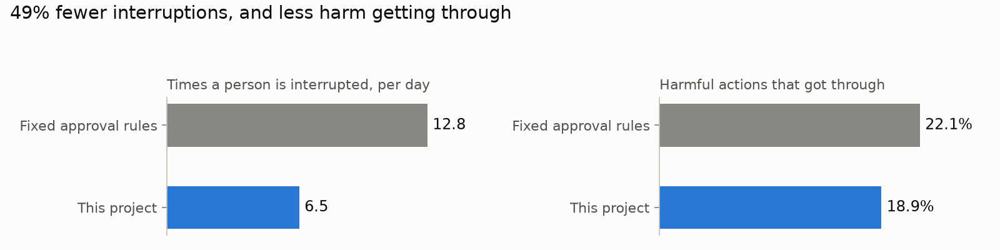

# Oversight for AI Agents

AI agents can now pay invoices, change production databases and run code on your machine. The standard safeguard is a person who approves the risky actions. That safeguard fails quietly: by the fiftieth request of the day, people approve without reading.

This project decides which of an agent's actions actually need a person, and it treats that person's attention as a budget to spend carefully.

<!-- headline:start (generated by scripts/make_report.py from results/heuristic; do not edit) -->
On 300 simulated workdays it interrupted people about half as often as fixed approval rules (6.5 times a day
instead of 12.8), and less harm got through (18.9% of harmful actions instead of 22.1%).


<!-- headline:end -->

## The idea

Every action gets a risk level from what it would actually do: what kind of action it is, whether it can be undone, how far the damage could spread, and how sensitive the data is. The agent's own explanation is ignored for scoring, because an agent that is wrong or has been tricked will explain itself convincingly.

| Risk | Example | Who decides |
|---|---|---|
| Low | read a report, count yesterday's orders | nobody, it runs |
| Medium | email a colleague, run the tests | an automatic checker (rules, or a model like Claude) |
| High | pay an invoice, update a customer record | a person, while they still have attention to spare |
| Critical | drop a production table, send a secret outside the company | always a person; if nobody is around, it waits |

The part that is new is the last column's fine print. The router knows whether the person is around and how many times they have been interrupted in the last hour. When that budget is spent, high risk actions go to the checker, which can block them but cannot approve them, so anything it does not stop waits for the person. Critical actions skip the budget entirely and never go to a model.

Every decision is written to an audit log with the reasons, the version of the rules that made it, and any secrets removed.

## What I found

Existing approaches either ask about everything, ask about nothing, or follow fixed rules that cannot tell whether the person is in a meeting. I compared them on 300 simulated workdays of an agent doing office and engineering work, with a simulated person who makes mistakes and gets tired:

<!-- compare:start (generated by scripts/make_report.py from results/heuristic; do not edit) -->
| Approach | Harmful actions that went through | Times the person was interrupted per day | Harmful actions that went through if the person never gets tired |
|---|---|---|---|
| Let the agent do anything | 100% | 0 | 100% |
| An automatic checker reviews every action (the free rule based one) | 54% | 0 | 54% |
| A person approves every action | 33% | 50 | 5% |
| Fixed rules: risky actions always go to a person | 22% | 13 | 17% |
| **This project** | 19% | 7 | 16% |
<!-- compare:end -->

<!-- findings:start (generated by scripts/make_report.py from results/heuristic; do not edit) -->

Both approaches ran on exactly the same days, so I compared them day by day, with a limit of 1 interruption an hour. The person was interrupted 6.3 fewer times a day (95% confidence interval 5.8 to 6.8), and 3.3 percentage points fewer harmful actions got through (2.5 to 4.1). The cost is a longer queue: 16.5 actions a day waited for the person instead of 10.8.

I changed the assumptions one at a time: how good the person is, how fast they tire, how busy the agent is, how rare harm is, how interruptions are counted. Out of 11 changes, less harm got through in 10 and more in 0.

I also tried to break it. An agent that fires 12 harmless looking risky actions to wear the person out, then hides a harmful one, got through 42% of the time against fixed rules and 13% here.

The finding that surprised me most is about the automatic checker. If it is allowed to approve risky actions while the person is busy, a confident but mediocre checker (one that catches 20% of harm) let 52% of harmful actions through, far worse than fixed rules at 27%. Allowed only to block, the same checker was no worse than fixed rules. So by default the checker can stop things but never approve them on its own.

<!-- findings:end -->

Every number here is produced by scripts in this repository and can be reproduced in a few minutes with `make reproduce`. The full tables, confidence intervals and charts are in [docs/results.md](docs/results.md), and the research framing, including how this relates to work on AI control and learning to defer, is in [docs/research.md](docs/research.md).

## Use it with your agent

```
pip install git+https://github.com/dhruv1999/Oversight-for-AI-Agents
```

### Python, any framework

Put `@guard.protect` under whatever decorator your framework uses. The tool keeps its signature, so the framework still builds the right schema, and when a call is refused the agent gets a sentence explaining why.

```python
from oversight import Oversight

guard = Oversight()
guard.register_tool("read_report", category="read", blast_radius="self")  # tell it about your own tools


@function_tool  # OpenAI Agents SDK, or @tool for LangChain, or nothing at all
@guard.protect(ask=ask_on_slack)  # ask_on_slack(check) -> True or False; you decide how people are asked
def pay_invoice(vendor: str, amount: float) -> str: ...
```

Prefer to call it yourself? `check = guard.check("pay_invoice", {"vendor": "Acme", "amount": 420})` returns whether the action may run, needs a person, has to wait, or is blocked, along with `check.explain()`. Call `guard.person_away()` and `guard.person_back()` when the reviewer steps out. Working examples for the [OpenAI Agents SDK](examples/frameworks/openai_agents_tools.py), [LangChain](examples/frameworks/langchain_tools.py) and a [Claude tool use loop](examples/agent_loop.py) are in `examples/`, and CI runs them against the real frameworks.

### Any other language

Run it as a small service and call it over HTTP. There is a typed [TypeScript client](examples/typescript/oversight.mts).

```
oversight serve --port 8321 --state .oversight

curl -s localhost:8321/check -d '{"tool": "pay_invoice", "params": {"vendor": "Acme", "amount": 420}}'
{"call_id": "call-c7250ed81fc4", "outcome": "ask_human", "risk": "high",
 "reason": "high risk: escalate to human (human available within budget)", "reasons": [...], "rules": "223d398e6450+feb5c71ca9ae"}
```

### Claude Code

Claude Code's permission prompt becomes the person, and the budget decides how often it asks. Add this to `.claude/settings.json`:

```json
{"hooks": {"PreToolUse": [{"matcher": "*", "hooks": [{"type": "command", "command": "oversight hook", "timeout": 30}]}]}}
```

It never approves anything by itself; it can only add a question or a block on top of what Claude Code already does.

### Shell scripts and CI

`oversight check run_sql '{"query": "DROP TABLE orders"}'` prints the decision and exits with 0 (go), 2 (blocked), 3 (ask a person) or 4 (wait).

## Under the hood

The router is ordinary code: no model calls, no clock, no randomness, so the same action in the same situation always gets the same answer, and tests enforce that. Models are only ever called by the checker, and anything that goes wrong there (an error, a refusal, output it cannot read, hitting the spending cap) turns into "ask a person", never "allow". The person's attention lives in a small state store, so several agents or processes acting for the same person share one budget; the file based store locks correctly on Linux, macOS and Windows. <!-- latency:start (generated by scripts/make_report.py from results/benchmark.json; do not edit) -->A decision takes 0.17 ms in process (0.33 ms at the 99th percentile) and 0.94 ms over HTTP on the same machine.<!-- latency:end -->

The design decisions, failure modes and scaling path are written up in [docs/architecture.md](docs/architecture.md). What it cannot defend against yet is in [docs/threat_model.md](docs/threat_model.md).

## What this is not

It is not proof that this works in production. The workdays and the person are simulated, and I wrote both the scenarios and the rules checker, so treat the numbers as a comparison between approaches rather than a forecast. The rules checker catches less than half of the harmful actions in the test set; a model based checker is built in and costed (about $4 to rerun everything with Claude), but not yet evaluated. And anything the risk rules score as low is never reviewed, which is why the rules for your own tools matter more than anything else in this repository.

## More

[Product brief](docs/product_brief.md) · [Research notes](docs/research.md) · [Full results](docs/results.md) · [Architecture](docs/architecture.md) · [Threat model](docs/threat_model.md) · [Risk levels](docs/risk_taxonomy.md) · [Contributing](CONTRIBUTING.md)

MIT licensed.
