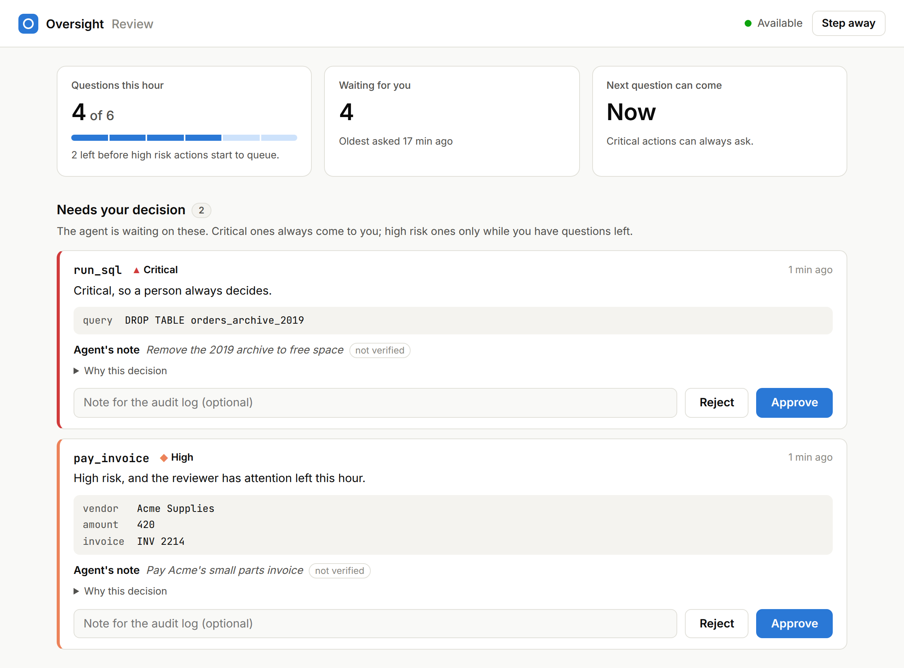
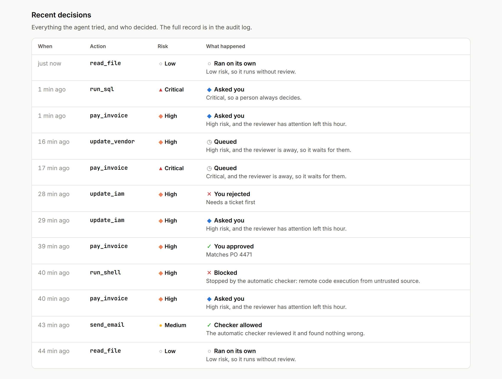

# Oversight for AI Agents

A free, open source library that decides which of an AI agent's actions need a person, and asks only as often as that person can actually pay attention.

## The problem

* AI agents now take real actions. They pay invoices, email customers, change databases and run code.
* The usual safeguard is a person who approves the risky ones.
* Approvals wear people out. By the fiftieth request of the day, people approve without reading.
* So teams choose between asking about everything, which turns into rubber stamping, and asking about nothing, which is hoping for the best.

## Why I built this

I'm a product manager. I think about a reviewer's attention the way I think about any scarce resource: spend it where it changes the outcome.

* Approval prompts are built as a switch, on or off for each tool.
* In practice every prompt uses up some of a person's attention, and that attention runs out.
* I wanted to treat it as a budget. Spend it on the actions that matter, let an automatic checker cover the rest, and never let anything critical run without a person.
* I wanted evidence rather than opinion, so the repository includes a simulation that compares this approach with the usual ones.

## What it looks like

The person who approves gets a review page. It shows how many questions they have left this hour, what is waiting for them, and an Approve and a Reject button for each. Everything else runs, or is checked automatically, without bothering them.



Every action the agent tries is listed with who decided: it ran on its own, the checker allowed or blocked it, or the person answered.



These are screenshots of the real page. A script plays a morning of agent actions through the service and photographs the result (`make screenshots`).

## Who it is for

| Who | What they want | What they get |
|---|---|---|
| Product manager shipping an agent feature | an agent that does real work without users approving everything | risk rules anyone can read, and a clear answer to "how is risk handled?" |
| The person who approves (finance lead, support manager, on call engineer) | fewer requests, and only the ones that matter | one page to answer from, and no more than 6 questions an hour by default, except for critical actions |
| Security and compliance | proof of what the agent did and why | a log of every decision with the reason, the rules in force, and secrets removed |
| Developer or platform engineer | something that fits the agent they already have | a few lines of code in Python, over MCP or HTTP, or as a Claude Code hook |

## What is out there

Most paid tools in this space screen what goes into and out of a model, or control access, and are sold to enterprises. The free options are toolkits you assemble yourself, and agent frameworks can pause before the tools you mark and wait for a yes.

| Tool | What it does | Cost |
|---|---|---|
| [Lakera Guard](https://www.lakera.ai) | catches prompt attacks and data leaks | free tier; enterprise plans through sales |
| [Zenity](https://zenity.io) | security and governance for company agents | enterprise, through sales |
| [Amazon Bedrock Guardrails](https://aws.amazon.com/bedrock/guardrails/) | filters harmful content and topics | pay per use |
| [Permit.io](https://www.permit.io) | access control for apps and agents, including requests a person approves | free tier; paid plans priced by active users |
| [Guardrails AI](https://www.guardrailsai.com) | checks model output against rules | open source; paid Pro version |
| [NVIDIA NeMo Guardrails](https://docs.nvidia.com/nemo/guardrails/) | programmable rules around a model, including checks on tool calls | free, open source |
| [LangGraph](https://docs.langchain.com/oss/python/langgraph/human-in-the-loop), [OpenAI Agents SDK](https://openai.github.io/openai-agents-python/) | pause before tools you mark and wait for approval | free, open source |

Where this project fits:

* It answers the question these tools leave to you: can this person still give a good approval right now? None of the tools above that I looked at keeps track of how often the reviewer has already been asked.
* It is free under the MIT license and runs on your own machines. Nothing leaves them unless you turn on an AI checker.
* It works alongside them. A content filter can screen what the model reads, while Oversight decides which actions a person sees.

*Based on public product pages and listings as of October 2026. Prices change, so check with each vendor.*

## Does it work?

<!-- headline:start (generated by scripts/make_report.py from results/heuristic; do not edit) -->
On 300 simulated workdays it interrupted people about half as often as fixed approval rules (6.5 times a day
instead of 12.8), and less harm got through (18.9% of harmful actions instead of 22.1%).


<!-- headline:end -->

## Where it helps

| Team | What the agent does | What changes |
|---|---|---|
| Finance | pays invoices, updates vendor records | nothing that moves money runs without a person |
| Customer support | replies to customers | a message to every customer always needs a person |
| Engineering | edits code, runs tests and commands | tests run freely; deleting files or running unknown scripts needs the developer |
| Data and analytics | queries the company database | reading runs freely; deleting a table always waits for a person |
| IT and operations | deploys software, grants access | at night, risky actions wait for morning instead of running unattended |

Each of these is explained in plain terms in [docs/use_cases.md](docs/use_cases.md).

## Quickstart

```
pip install git+https://github.com/dhruv1999/Oversight-for-AI-Agents
```

```python
from oversight import Oversight

guard = Oversight()
check = guard.check("pay_invoice", {"vendor": "Acme", "amount": 420})
print(check.explain())  # pay_invoice: ask_human (high risk), followed by the reasons
```

## Use it with your agent

| Your agent | How to connect | Details |
|---|---|---|
| Python (OpenAI Agents SDK, LangChain, plain functions) | add `@guard.protect` to each tool | [Python](docs/integrations.md#python) |
| Any MCP client | run `oversight mcp -- <server command>` in place of the server | [MCP](docs/integrations.md#mcp) |
| Any other language | run `oversight serve` and send `POST /check`; people answer on its review page | [HTTP](docs/integrations.md#http-for-any-language) |
| Claude Code | set `oversight hook` as a PreToolUse hook | [Claude Code](docs/integrations.md#claude-code) |
| Shell scripts and CI | `oversight check` and branch on the exit code | [Command line](docs/integrations.md#command-line) |

## Choose the checker

Medium risk actions, and high risk ones when the reviewer is out of attention, go to an automatic checker. Use the free rules checker, or a model from the provider you already pay for:

| Checker | Turn it on in Python | On the command line |
|---|---|---|
| Free rules checker | nothing to do, it is the default | nothing to do |
| Anthropic Claude | `Oversight.with_llm("anthropic")` | `--checker anthropic` |
| OpenAI | `Oversight.with_llm("openai", model=..., price_per_mtok=...)` | `--checker openai --model ... --price ...` |
| Azure OpenAI | `Oversight.with_llm("azure", model="your deployment", price_per_mtok=...)` | `--checker azure --model ... --price ...` |
| Google Gemini | `Oversight.with_llm("gemini", model=..., price_per_mtok=...)` | `--checker gemini --model ... --price ...` |

Every AI checker caches its answers, stops spending at a cap you set, and sends the action to a person if anything goes wrong. Only Claude's prices are built in; for other models you give the price per million tokens, so the cap works. Details are in [Choosing the checker](docs/integrations.md#choosing-the-checker).

## How it decides

Every action gets a risk level from what it would actually do: what kind of action it is, whether it can be undone, how far the damage could spread, and how sensitive the data is. The agent's own explanation is ignored for scoring, because an agent that is wrong or has been tricked will explain itself convincingly.

| Risk | Example | Who decides |
|---|---|---|
| Low | read a report, count yesterday's orders | nobody, it runs |
| Medium | email a colleague, run the tests | an automatic checker (free rules, or a model from Anthropic, OpenAI, Azure or Google) |
| High | pay an invoice, update a customer record | a person, while they still have attention to spare |
| Critical | drop a production table, send a secret outside the company | always a person; if nobody is around, it waits |

The part that is new is the last column's fine print. The router knows whether the person is around and how many times they have been interrupted in the last hour. When that budget is spent, high risk actions go to the checker, which can block them but cannot approve them, so anything it does not stop waits for the person. Critical actions skip the budget entirely and never go to a model.

Every decision is written to an audit log with the reasons, the version of the rules that made it, and any secrets removed.

## Results

I compared the common approaches on 300 simulated workdays of an agent doing office and engineering work, with a simulated person who makes mistakes and gets tired:

<!-- compare:start (generated by scripts/make_report.py from results/heuristic; do not edit) -->
| Approach | Harmful actions that went through | Times the person was interrupted per day | Harmful actions that went through if the person never gets tired |
|---|---|---|---|
| Let the agent do anything | 100% | 0 | 100% |
| An automatic checker reviews every action (the free rule based one) | 54% | 0 | 54% |
| A person approves every action | 33% | 50 | 5% |
| Fixed rules: risky actions always go to a person | 22% | 13 | 17% |
| **This project** | 19% | 7 | 16% |
<!-- compare:end -->

The result held when I changed the assumptions one at a time and when I tried to game the system on purpose. Confidence intervals, the robustness tests, the attack test and charts are in [docs/results.md](docs/results.md). Every number is produced by scripts in this repository and can be reproduced with `make reproduce`.

## Under the hood

The router is ordinary code: no model calls, no clock, no randomness, so the same action in the same situation always gets the same answer, and tests enforce that. Models are only ever called by the checker, and anything that goes wrong there (an error, a refusal, output it cannot read, hitting the spending cap) turns into "ask a person", never "allow". The person's attention lives in a small state store, so several agents or processes acting for the same person share one budget; the file based store locks correctly on Linux, macOS and Windows. <!-- latency:start (generated by scripts/make_report.py from results/benchmark.json; do not edit) -->A decision takes 0.17 ms in process (0.33 ms at the 99th percentile) and 0.94 ms over HTTP on the same machine.<!-- latency:end -->

The design decisions, failure modes and scaling path are written up in [docs/architecture.md](docs/architecture.md). What it cannot defend against yet is in [docs/threat_model.md](docs/threat_model.md).

## What this is not

It is not proof that this works in production. The workdays and the person are simulated, and I wrote both the scenarios and the rules checker, so treat the numbers as a comparison between approaches rather than a forecast. The rules checker catches less than half of the harmful actions in the test set; AI checkers for Claude, OpenAI, Azure OpenAI and Gemini are built in, and rerunning everything with Claude would cost about $4, but none has been evaluated yet. And anything the risk rules score as low is never reviewed, which is why the rules for your own tools matter more than anything else in this repository.

## More

[Use cases](docs/use_cases.md) · [Integrations](docs/integrations.md) · [Full results](docs/results.md) · [Research notes](docs/research.md) · [Product brief](docs/product_brief.md) · [Architecture](docs/architecture.md) · [Threat model](docs/threat_model.md) · [Risk levels](docs/risk_taxonomy.md) · [Contributing](CONTRIBUTING.md)

MIT licensed.
