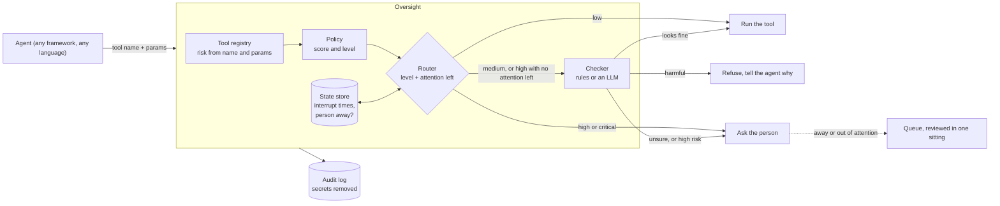

# Architecture

## What it is

A decision point that sits between an AI agent and its tools. For every tool call it answers one question: can this run now, should it be stopped, or does a person need to decide? It keeps track of how much attention that person has left, and it writes down every answer with the reasons.

## Ways to run it

| Mode | How | Shares one person's budget across | Use it when |
|---|---|---|---|
| Library | `Oversight()` | threads in one process | one agent in one Python process |
| Library with shared state | `Oversight(state=".oversight")` | processes on one machine | several agents or workers acting for the same person |
| HTTP service | `oversight serve` | every client of the service | agents in other languages, or many machines |
| MCP proxy | `oversight mcp -- <server>` | every call through that proxy | any MCP client (desktop apps, IDEs, agent frameworks) in front of any MCP server; people are asked through MCP elicitation |
| Claude Code hook | `oversight hook` | every Claude Code tool call in a project | a coding agent on a developer's laptop |
| Command line | `oversight check TOOL PARAMS` | nothing | shell scripts and CI jobs (exit code says what to do) |

All six go through the same `Oversight.check`, so the rules and the log format are identical everywhere.

## Decisions and why

**The router is plain code, not a model.** Given the same action, policy and attention state it gives the same answer, it can be tested exhaustively, and it runs in well under a millisecond. Models are only called by the checker, behind an interface that fails closed. Tests enforce both rules: provider SDKs are imported only in `oversight/adapters/`, and the policy, attention and router modules never read a clock or use randomness.

**Risk comes from what the action does, not from what the agent says about it.** The tool registry scores the tool name and its parameters. The agent's description is kept for the log and shown to an LLM checker as untrusted text, but never scored. Registry rules can only raise risk, and unknown tools start high.

**Critical actions always wait for a person.** They bypass the interrupt budget and are never handed to a model. If nobody is around they wait.

**When the checker takes over, it may block but not approve.** High risk actions go to the checker only when the person is out of attention, and by default the checker can then stop them but never let them through on its own. The simulation showed that a confident but mediocre checker allowed to approve made things worse than fixed rules ([results](results.md#how-good-must-the-checker-be)). `takeover: approve` exists for teams whose checker has earned it.

**Fail closed everywhere.** A checker that crashes, times out, refuses, returns something unreadable, or would exceed `MAX_SPEND_USD` becomes "ask a person". The HTTP service answers `ask_human` with status 500 if anything inside it breaks. The Claude Code hook answers "ask" on any error.

**The person's attention is shared state, not process state.** It lives behind a `StateStore` with one operation, `transaction()`: read, decide and write as one step. `MemoryStore` serves one process; `FileStore` serves many processes on one machine with an OS file lock (Linux, macOS and Windows) and atomic replace. A failed decision is never saved. A Redis or database store only has to implement `transaction()`.

**A slow checker must not block other agents.** Medium risk actions always go to the checker and do not depend on the person's state, so they are reviewed before the state lock is taken; four agents waiting on a 0.4 second model finish together instead of one after another (a test checks this). The rarer takeover path, where the budget decides whether the checker is needed, reviews inside the lock.

**Every log line says which rules decided.** Records carry `log_version` and a fingerprint of the policy and tool registry files, so an auditor can tell which rules produced any past decision, even after the rules change.

**Secrets never reach disk.** Parameters are redacted (API keys, passwords, tokens, private keys, bearer headers, keys named like secrets) before anything is written to the audit log or the deferred queue. The checker still sees the full parameters, because it needs them to judge.

**Standard library for the core.** The core depends only on PyYAML. The HTTP service is `http.server`. The Anthropic SDK is an optional extra. Nothing forces an agent framework on the user.

## Performance

<!-- bench:start (generated by scripts/make_report.py from results/benchmark.json; do not edit) -->
Time for one decision with the rules checker, measured by `scripts/benchmark.py` (Python 3.11.15, 4 CPUs, a mix of low to critical actions):

| Mode | Median | 99th percentile | Decisions per second |
|---|---|---|---|
| Library, one process | 0.17 ms | 0.33 ms | 5,929 |
| Library, state shared through a file | 0.50 ms | 1.08 ms | 1,820 |
| HTTP service, same machine | 0.94 ms | 1.34 ms | 1,045 |
<!-- bench:end -->

A model based checker adds that model's latency, but only on medium risk actions and on high risk actions that overflow the budget. Its answers are cached per unique action.

## Failure modes

| What fails | What happens | Why that is the safe choice |
|---|---|---|
| Checker errors, times out or refuses | action goes to the person (or waits) | never allow what nobody looked at |
| Spend cap reached | same as above; no call is made | cost cannot run away |
| Checker output unreadable | same as above | a parse error is not an approval |
| State file corrupt or missing | starts from a fresh state (full budget, person available) | availability over lockout; the log still has history |
| Crash in the middle of a decision | nothing is saved for that decision | state never reflects a half made decision |
| Two agents decide at the same moment | the file lock orders them | the budget cannot be spent twice (a test proves it: all 12 of 12 interrupts kept with the lock, only 2 or 3 of 12 in our runs without it) |
| HTTP service error | status 500 with `outcome: ask_human` | a client that only reads `outcome` still fails safe |
| Unknown tool | scored with cautious defaults (high risk) | new tools are reviewed until someone declares their risk |
| Person never comes back | queued actions do not run | nothing irreversible happens unattended |

## Security

The HTTP service binds to `127.0.0.1` unless told otherwise, accepts a bearer token (`OVERSIGHT_TOKEN`, compared in constant time), and rejects bodies over 1 MB. Audit logs and queues are redacted. The state files can be edited by anyone with access to the directory, so the Claude Code hook is a guardrail inside a trusted machine, not a sandbox. The threat model, including what is not defended, is in [threat_model.md](threat_model.md).

## Scaling path

1. **One team, many agents on one machine:** `FileStore` works today.
2. **Many machines:** run `oversight serve` once per person or team, or implement a `StateStore` on Redis (`WATCH`/`MULTI` or a Lua script around the same read, decide, write step).
3. **Many people:** one state per reviewer, plus routing to whoever is on call. Not built yet; the state already keys on nothing but the store, so this is a store and router change, not a rewrite.
4. **Spend across processes:** the spend cap is enforced per process today (the ledger is read at start). A shared cap needs the same store treatment.

## Code map

| Module | Job |
|---|---|
| `guard.py` | `Oversight`: the one entry point; `check`, `protect`, `register_tool`, `person_away` |
| `registry.py` | risk metadata from tool name and parameters (`policies/tools.yaml`) |
| `policy.py` | scores, levels, overrides, validation, fingerprint (`policies/default.yaml`) |
| `attention.py` | availability, interrupt budget, minimum gap; time is always passed in |
| `allocator.py` | the router; `baselines.py` holds the routers it is compared against |
| `gate.py` | routing, checker, fail closed handling and the audit record |
| `safety_model.py` | the LLM checker and the rules checker; the only place model calls start |
| `adapters/` | provider SDK code (Anthropic today) |
| `store.py` | where the attention state lives |
| `server.py`, `cli.py`, `integrations/` | HTTP service, command line, MCP proxy, Claude Code hook |
| `redact.py`, `cache.py`, `spend.py`, `pricing.py` | secrets, model answer cache, spending cap |
| `sim/` | synthetic actions, workdays, schedules, simulated person and checker, statistics |
