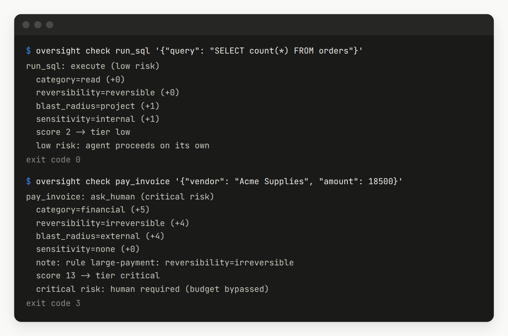

# Integrations

Every integration goes through the same `Oversight.check`, so the rules, the interruption budget and the audit log behave the same way everywhere.

```
pip install git+https://github.com/dhruv1999/Oversight-for-AI-Agents
```

## Python

Put `@guard.protect` under whatever decorator your agent framework uses. The tool keeps its signature, so the framework still builds the right schema, and when a call is refused the agent receives a sentence explaining why.

```python
from oversight import Oversight

guard = Oversight()
guard.register_tool("read_report", category="read", blast_radius="self")  # tell it about your own tools


@function_tool  # OpenAI Agents SDK, or @tool for LangChain, or nothing at all
@guard.protect(ask=ask_on_slack)  # ask_on_slack(check) returns True or False; you decide how people are asked
def pay_invoice(vendor: str, amount: float) -> str: ...
```

With the OpenAI Agents SDK, also pass `failure_error_function=tool_error_message` (from `oversight.integrations.openai_agents`) to `@function_tool`. Since version 0.23 the SDK hides tool errors from the model by default; this helper lets oversight refusals through so the agent knows why it was stopped, and keeps every other error hidden.

You can also call it directly. `guard.check(tool, params)` tells you whether the action may run, needs a person, has to wait, or is blocked, and `check.explain()` gives the reasons. Call `guard.person_away()` and `guard.person_back()` when the reviewer steps out, and `guard.record_answer(check, approved=True)` to log what they decided.

Working examples, which CI runs against the real frameworks:

* [OpenAI Agents SDK](../examples/frameworks/openai_agents_tools.py)
* [LangChain](../examples/frameworks/langchain_tools.py)
* [Claude tool use loop](../examples/agent_loop.py)

## MCP

Run the proxy in place of the server. It starts the real server, offers exactly the same tools, and checks every call before forwarding it. When a person is needed it asks through the client's own approval prompt (MCP elicitation). A client that cannot ask gets a refusal that says why.

```json
{"mcpServers": {"filesystem": {"command": "oversight",
  "args": ["mcp", "--", "npx", "-y", "@modelcontextprotocol/server-filesystem", "/path/to/project"]}}}
```

This needs the optional MCP dependency:

```
pip install "oversight-for-ai-agents[mcp] @ git+https://github.com/dhruv1999/Oversight-for-AI-Agents"
```

Tool names the rules do not recognise start as high risk. Declare them in your own copy of `oversight/policies/tools.yaml` and pass it with `oversight --tools your_tools.yaml mcp -- <server command>`.

## HTTP, for any language

Run it as a small service and call it from anything that can send a request. A typed [TypeScript client](../examples/typescript/oversight.mts) is included.

```
oversight serve --port 8321 --state .oversight

curl -s localhost:8321/check -d '{"tool": "pay_invoice", "params": {"vendor": "Acme", "amount": 420}}'
{"call_id": "call-dc74a9130b4b", "outcome": "ask_human", "risk": "high",
 "reason": "high risk: escalate to human (human available within budget)",
 "summary": "High risk, and the reviewer has attention left this hour.", "reasons": [...], "rules": "223d398e6450+feb5c71ca9ae"}
```

Open the address it prints in a browser to get the review page. The person sees how many questions they have left this hour, approves or rejects what is waiting (with an optional note for the audit log), and marks themselves away or back. Actions that were queued while they were away wait there too.


An agent that wants the person to decide on that page polls `GET /checks/<call_id>` until it says `approved` or `rejected`. The TypeScript client does this for you: pass `"review-page"` as the third argument to `guarded`. Agents that ask people some other way, in Slack for example, record the answer with `POST /answer` instead. `POST /person` marks the person away or back, and `GET /inbox` returns everything the page shows.

The service listens on localhost only unless told otherwise. `OVERSIGHT_TOKEN` turns on bearer token authentication; set it whenever anyone else can reach the service. How the page is protected is in the [threat model](threat_model.md#the-review-page).

## Claude Code

Claude Code's permission prompt becomes the person, and the budget decides how often it asks. Add this to `.claude/settings.json` in your project:

```json
{"hooks": {"PreToolUse": [{"matcher": "*", "hooks": [{"type": "command", "command": "oversight hook", "timeout": 30}]}]}}
```

The hook never approves anything by itself. It can only add a question or a block on top of what Claude Code already does. Decisions are logged in `.oversight/` in your project, with secrets removed.

## Choosing the checker

Medium risk actions, and high risk ones when the person is out of attention, go to an automatic checker. The free rules checker is the default. Any of these models can take its place, with the same instructions, the same answer format and the same safety rules:

| Provider | Install | Key and settings it reads |
|---|---|---|
| Anthropic | `[anthropic]` | `ANTHROPIC_API_KEY`; Claude Opus 5.5 unless you name another model |
| OpenAI | `[openai]` | `OPENAI_API_KEY`; `base_url` points it at any other server that speaks the OpenAI API |
| Azure OpenAI | `[openai]` | `AZURE_OPENAI_ENDPOINT`, `AZURE_OPENAI_API_KEY` and `OPENAI_API_VERSION`; the model is your deployment name |
| Google Gemini | `[gemini]` | `GEMINI_API_KEY`; for Vertex AI, pass your own `genai.Client(vertexai=True, ...)` as `client` |

```
pip install "oversight-for-ai-agents[openai] @ git+https://github.com/dhruv1999/Oversight-for-AI-Agents"
```

```python
from oversight import Oversight

guard = Oversight.with_llm("anthropic")  # Claude Opus 5.5, prices built in
guard = Oversight.with_llm("openai", model="<model>", price_per_mtok=(input_price, output_price))
guard = Oversight.with_llm(
    "azure",
    model="<deployment>",
    price_per_mtok=(input_price, output_price),
    options={"endpoint": "https://<resource>.openai.azure.com", "api_version": "<version>"},
)
guard = Oversight.with_llm("gemini", model="<model>", price_per_mtok=(input_price, output_price), max_spend_usd=5)
```

The command line, the HTTP service and the MCP proxy take the same choice: `oversight --checker gemini --model <model> --price <input>,<output> serve`. The Claude Code hook reads it from `OVERSIGHT_REVIEWER`, `OVERSIGHT_MODEL` and `OVERSIGHT_PRICE`.

What every AI checker does:

* **Prices you give.** Only Claude's prices are built in, because other providers change theirs often and Azure prices depend on your contract. Give the price in USD per million input and output tokens, or `(0, 0)` for a model you host yourself. Without a price the checker will not start.
* **A spending cap.** `max_spend_usd` (or `MAX_SPEND_USD`, $1 by default) is checked before every call. Thinking tokens count as output, because providers bill them that way.
* **A cache.** Each distinct action is reviewed once; repeats cost nothing. Answers live in `.oversight/review_cache.jsonl`.
* **Fail closed.** A refusal, a content filter, an error, an unreadable answer or a reached cap sends the action to a person. It never lets it through.
* **Low effort by default.** Claude's `effort`, OpenAI's `reasoning_effort` and Gemini's `thinking_level` start at `low`; change them through `options`, or set them to `None` for models that do not support them.

Each adapter is tested against its provider's official SDK with a local stand in server, which checks the exact request the provider would receive. None has been run against a live service from this repository yet, and none has been evaluated on the test set.

## Command line

```
oversight check run_sql '{"query": "DROP TABLE orders"}'
```

This prints the decision and its reasons, then exits with 0 when the action may run, 2 when it is blocked, 3 when a person must decide, and 4 when it has to wait. Shell scripts and CI jobs can branch on that.


