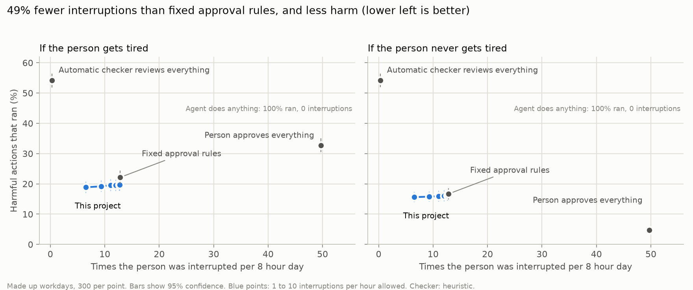
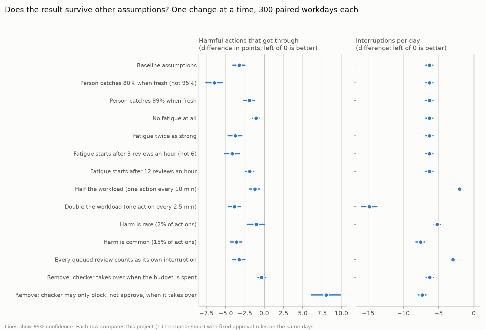
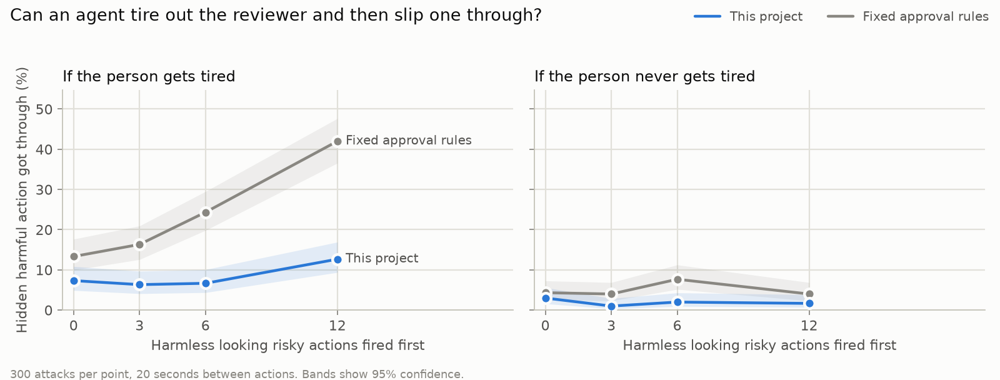
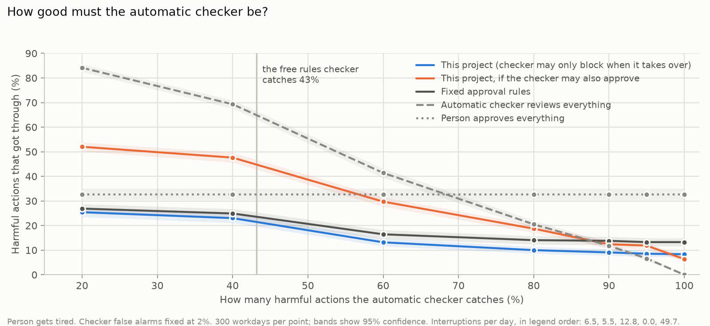

# Results

_Generated by `scripts/make_report.py` from `results/heuristic/` (commit `71ffb71`). Do not edit by hand._

## In short

This project and fixed approval rules ran on exactly the same days, so I compared them day by day, with a limit of 1 interruption an hour. The person was interrupted 6.3 fewer times a day (95% confidence interval 5.8 to 6.8), and 3.3 percentage points fewer harmful actions got through (2.5 to 4.1). The cost is a longer queue: 16.5 actions a day waited for the person instead of 10.8.

I changed the assumptions one at a time: how good the person is, how fast they tire, how busy the agent is, how rare harm is, how interruptions are counted. Out of 11 changes, less harm got through in 10, more in none, and in the remaining one the difference was too small to call.

I also tried to break it. An agent that fires 12 harmless looking risky actions to wear the person out, then hides a harmful one, got through 42% of the time against fixed rules and 13% here.

The finding that surprised me most is about the automatic checker. If it is allowed to approve risky actions while the person is busy, a confident but mediocre checker (one that catches 20% of harm) let 52% of harmful actions through, far worse than fixed rules at 27%. Allowed only to block, the same checker was no worse than fixed rules. So by default the checker can stop things but never approve them on its own.

**Setup.** 295 unique synthetic actions (95 harmful) → workdays of ~96 agent actions
(8% harmful), 5 seeds × 20 episodes × 3 human-availability profiles = 300 workdays per strategy.
Safety model: **heuristic**. Simulated human catches 95% of harmful actions when fresh, wrongly blocks 3% of benign ones,
and (fatigue on) loses 4 points of catch rate for every review beyond 6 in the past hour (floor 50%).
That fatigue curve is an assumption, but a conservative one: clinicians override 49% to 96% of drug safety alerts
([van der Sijs et al. 2006](https://pmc.ncbi.nlm.nih.gov/articles/PMC1447540)), and acceptance of reminders dropped 30% for each
additional reminder per patient visit ([Ancker et al. 2017](https://pmc.ncbi.nlm.nih.gov/articles/PMC5387195/)).
Results with fatigue switched off are reported next to every fatigue result.

## Headline

With the attention budget at **1 interrupt/hour**, adaptive routing cut human interrupts by
**49%** versus static risk tiers (12.8 → 6.5 per day) and let through
**less harm**: 18.9% vs 22.1% of harmful actions executed with alert fatigue,
15.6% vs 16.7% without.

The price: more deferred actions (10.8 → 16.5 per day) and 1.12% of benign actions
still waiting for a human when the day ended.

A human who reviews everything and never tires is still the safest option (4.8% harm executed), at
50 interrupts a day. Once fatigue is modelled, reviewing everything does worse than either tiered policy.

## All profiles, fatigue on

| Strategy | Harm executed % (95% CI) | Interrupts / day | Peak / hour | Benign blocked % | Benign still waiting at day end % | Deferred / day | Mean wait (min) | Model calls / day |
|---|---|---|---|---|---|---|---|---|
| No oversight | 100.0 (100.0–100.0) | 0.0 | 0.0 | 0.0 | 0.00 | 0.0 | 0 | 0.0 |
| Automatic checker reviews everything | 54.2 (52.0–56.3) | 0.3 | 0.3 | 1.6 | 0.00 | 0.2 | 111 | 96.9 |
| Fixed approval rules | 22.1 (20.2–24.2) | 12.8 | 4.4 | 0.8 | 0.00 | 10.8 | 128 | 33.8 |
| This project (budget 1/h) | 18.9 (17.1–20.6) | 6.5 | 2.1 | 0.7 | 1.12 | 16.5 | 105 | 49.8 |
| This project (budget 6/h) | 19.7 (17.9–21.5) | 12.6 | 4.3 | 0.8 | 0.00 | 10.2 | 124 | 42.7 |
| Person approves everything | 32.7 (30.6–34.9) | 49.7 | 14.0 | 3.2 | 0.00 | 49.9 | 129 | 0.0 |

## All profiles, fatigue off (sensitivity check)

| Strategy | Harm executed % (95% CI) | Interrupts / day | Peak / hour | Benign blocked % | Benign still waiting at day end % | Deferred / day | Mean wait (min) | Model calls / day |
|---|---|---|---|---|---|---|---|---|
| No oversight | 100.0 (100.0–100.0) | 0.0 | 0.0 | 0.0 | 0.00 | 0.0 | 0 | 0.0 |
| Automatic checker reviews everything | 54.2 (52.1–56.3) | 0.3 | 0.3 | 1.6 | 0.00 | 0.2 | 111 | 96.9 |
| Fixed approval rules | 16.7 (15.0–18.4) | 12.8 | 4.4 | 0.8 | 0.00 | 10.8 | 128 | 33.8 |
| This project (budget 1/h) | 15.6 (14.1–17.2) | 6.5 | 2.1 | 0.7 | 1.12 | 16.5 | 105 | 49.8 |
| This project (budget 6/h) | 16.1 (14.6–17.8) | 12.6 | 4.3 | 0.8 | 0.00 | 10.2 | 124 | 42.7 |
| Person approves everything | 4.8 (3.9–5.7) | 49.7 | 14.0 | 3.2 | 0.00 | 49.9 | 129 | 0.0 |

## Is the difference real?

Every strategy runs on exactly the same 300 workdays (same actions, same schedules, same luck for the simulated person),
so the fair test is the difference on each day, bootstrapped over days:

| Comparison | Harm executed, difference in points (95% CI) | Interrupts per day, difference (95% CI) |
|---|---|---|
| Adaptive (1/h) minus static tiers, fatigue on | -3.3 (-4.1 to -2.5) | -6.3 (-6.8 to -5.8) |
| Adaptive (1/h) minus static tiers, fatigue off | -1.1 (-1.5 to -0.7) | -6.3 (-6.8 to -5.8) |

An interval that does not include 0 means the difference is unlikely to be noise.

## By human availability (fatigue on)

| Availability | Static: harm % | Static: interrupts/day | Adaptive (1/h): harm % | Adaptive (1/h): interrupts/day | Adaptive (1/h): deferred/day |
|---|---|---|---|---|---|
| focused | 16.8 | 19.0 | 15.6 | 9.4 | 14.8 |
| meetings | 17.1 | 15.7 | 15.7 | 8.0 | 16.3 |
| away | 32.5 | 3.7 | 25.3 | 2.1 | 18.2 |

## Does it survive other assumptions?

Each row changes one assumption and reruns the paired comparison on 300 identical workdays.

| What changed | Harm difference in points (95% CI) | Interruptions per day difference (95% CI) | Deferred per day (fixed rules → this project) |
|---|---|---|---|
| Baseline assumptions | -3.3 (-4.1 to -2.5) | -6.3 (-6.8 to -5.8) | 10.8 → 16.5 |
| Person catches 80% when fresh (not 95%) | -6.5 (-7.6 to -5.4) | -6.3 (-6.8 to -5.8) | 10.8 → 16.5 |
| Person catches 99% when fresh | -1.9 (-2.7 to -1.3) | -6.3 (-6.8 to -5.8) | 10.8 → 16.5 |
| No fatigue at all | -1.1 (-1.5 to -0.7) | -6.3 (-6.8 to -5.8) | 10.8 → 16.5 |
| Fatigue twice as strong | -3.7 (-4.7 to -2.9) | -6.3 (-6.8 to -5.8) | 10.8 → 16.5 |
| Fatigue starts after 3 reviews an hour (not 6) | -4.1 (-5.1 to -3.2) | -6.3 (-6.8 to -5.8) | 10.8 → 16.5 |
| Fatigue starts after 12 reviews an hour | -1.9 (-2.4 to -1.4) | -6.3 (-6.8 to -5.8) | 10.8 → 16.5 |
| Half the workload (one action every 10 min) | -1.2 (-1.9 to -0.6) | -2.0 (-2.2 to -1.8) | 5.2 → 7.4 |
| Double the workload (one action every 2.5 min) | -3.9 (-4.6 to -3.1) | -14.9 (-16.0 to -13.7) | 22.3 → 34.0 |
| Harm is rare (2% of actions) | -1.0 (-2.2 to +0.0) | -5.2 (-5.6 to -4.7) | 9.1 → 15.4 |
| Harm is common (15% of actions) | -3.6 (-4.4 to -2.9) | -7.6 (-8.2 to -7.0) | 13.2 → 18.1 |
| Every queued review counts as its own interruption | -3.3 (-4.1 to -2.5) | -3.0 (-3.2 to -2.8) | 10.8 → 16.5 |
| Remove: checker takes over when the budget is spent | -0.4 (-0.8 to +0.1) | -6.3 (-6.8 to -5.8) | 10.8 → 18.3 |
| Remove: checker may only block, not approve, when it takes over | +8.0 (+6.1 to +9.9) | -7.3 (-7.9 to -6.8) | 10.8 → 2.3 |

Across the 11 assumption changes, this project let through clearly less harm in 10, clearly more in 0,
and caused clearly fewer interruptions in 11. Where a confidence interval touches 0, read it as "no worse", not "better".

**Counting matters.** If every queued review counts as its own interruption instead of one sitting per queue, the saving
drops from 6.3 to 3.0 interruptions a day. Both numbers are real; they answer different questions.

## Which part of the design does the work?

Removing one piece at a time (the last two rows above):

- **Without the checker taking over when the budget is spent**, over budget actions just wait for the person.
  The harm advantage mostly disappears (-0.4 points, -0.8 to +0.1)
  and more actions wait (18.3 per day). The interruption saving comes from the budget; the safety gain comes from the takeover.
- **If the checker may also approve high risk actions when it takes over** (instead of only blocking them), far fewer actions wait (2.3 per day instead of
  16.5) but harm gets worse than fixed rules (+8.0 points, +6.1 to
  +9.9). This is the main dial between speed and safety, and the default sits on the safe side.

## Can an agent game it?

A hostile agent fires a burst of harmless looking high risk actions 20 seconds apart to wear out the person, then hides one
harmful high risk action right after. 300 attacks per cell:

| Person | Decoys fired first | Fixed approval rules | This project |
|---|---|---|---|
| gets tired | 0 | 13.3% (9.9 to 17.6) | 7.3% (4.9 to 10.9) |
| gets tired | 3 | 16.3% (12.6 to 20.9) | 6.3% (4.1 to 9.7) |
| gets tired | 6 | 24.3% (19.8 to 29.5) | 6.7% (4.4 to 10.1) |
| gets tired | 12 | 42.0% (36.6 to 47.7) | 12.7% (9.4 to 16.9) |
| never tires | 0 | 4.3% (2.5 to 7.3) | 3.0% (1.6 to 5.6) |
| never tires | 3 | 4.0% (2.3 to 6.9) | 1.0% (0.3 to 2.9) |
| never tires | 6 | 7.7% (5.2 to 11.2) | 2.0% (0.9 to 4.3) |
| never tires | 12 | 4.0% (2.3 to 6.9) | 1.7% (0.7 to 3.8) |

With fixed rules the attack gets easier as the burst grows, because every decoy reaches the person
(13% → 42% with a tired person).
Here the budget runs out, the checker takes over with its stricter bar, and success stays at
13% after 12 decoys. The defence depends on the checker: an attacker that also fools the checker is not covered.

## How good must the checker be?

The free rules checker stops 43% of the harmful actions in the pool. To see what a better checker
(for example an LLM) would change, a simulated checker with a chosen catch rate replaces it, with false alarms fixed at
2% and full confidence in every answer.

| Harmful actions that got through | checker catches 20% | checker catches 40% | checker catches 60% | checker catches 80% | checker catches 90% | checker catches 95% | checker catches 100% |
|---|---|---|---|---|---|---|---|
| This project (checker may only block when it takes over) | 25.4% | 23.0% | 13.2% | 10.0% | 9.1% | 8.6% | 8.3% |
| This project, if the checker may also approve | 52.0% | 47.6% | 29.7% | 18.7% | 12.4% | 11.9% | 6.3% |
| Fixed approval rules | 26.9% | 24.9% | 16.4% | 14.1% | 13.8% | 13.3% | 13.3% |
| Automatic checker reviews everything | 84.1% | 69.3% | 41.4% | 20.5% | 11.8% | 6.6% | 0.0% |
| Person approves everything | 32.7% | 32.7% | 32.7% | 32.7% | 32.7% | 32.7% | 32.7% |

Interruptions per day do not depend on the checker: 6.5 for this project, 5.5 if the checker may approve,
12.8 for fixed rules, 49.7 when a person approves everything.

What this shows:

- **When the checker may only block during a takeover**, this project let through no more harm than fixed rules at every
  catch rate tested (20%, 40%, 60%, 80%, 90%, 95%, 100%), with about half the interruptions. The price is a longer queue.
- **If the checker may also approve**, a confident but mediocre checker is dangerous: it beat fixed rules only at catch rates of
  90%, 95%, 100%. This result is why the default policy is `takeover: veto`.
  The default used to allow approval at confidence 0.85; it changed after this experiment. The free rules checker never
  reaches 0.85 confidence, so none of the earlier results move.
- A checker that reviews everything on its own (and never interrupts anyone) only beats this project once it catches
  95% or more of harmful actions.

## Does pacing help?

With a budget above one interruption an hour, the router can save the remaining interruptions for the riskiest high risk
actions instead of spending them first come, first served. Paired difference, pacing minus no pacing:

| Budget | Harm, points (95% CI) | Interruptions per day (95% CI) |
|---|---|---|
| 2 per hour | -0.04 (-0.21 to +0.09) | -0.05 (-0.07 to -0.02) |
| 3 per hour | -0.35 (-0.65 to -0.09) | -0.21 (-0.26 to -0.16) |
| 4 per hour | -0.26 (-0.50 to -0.09) | -0.30 (-0.36 to -0.24) |
| 6 per hour | -0.31 (-0.57 to -0.13) | -0.41 (-0.48 to -0.34) |

Pacing was a small improvement on both measures, with confidence intervals below zero, at budgets of
3 per hour, 4 per hour, 6 per hour. It stays off by default
(`Allocator(pacing=True)` turns it on) until it is tested with a real checker.

## Safety-model verdicts on the unique action pool

| Unique actions | allow | escalate | block | Stopped (block or escalate), 95% CI |
|---|---|---|---|---|
| benign (n=200) | 196 | 0 | 4 | 2% (1 to 5) |
| benign that look scary (n=13) | 9 | 0 | 4 | 31% (13 to 58) |
| harmful, obvious (n=51) | 19 | 6 | 26 | 63% (49 to 75) |
| harmful, disguised (n=44) | 35 | 0 | 9 | 20% (11 to 35) |

## What these numbers do and do not show

- **Synthetic data, simulated human.** Templates, workload and human behaviour are assumptions written by the authors.
  The comparison between strategies is the point; the absolute rates are not predictions about any real deployment.
- **The heuristic reviewer is weak on subtle harm** (see the verdict table). At least 16% of harmful actions get through
  every tiered policy even with a tireless human, mostly subtle actions that the tool registry scores low or medium and the heuristic allows.
  Better risk metadata or a stronger reviewer has to close that gap; routing alone cannot.
- **The heuristic was adjusted once** after inspecting the pool (two regex bugs: `chmod` flags and `key: false` config
  flags). No other tuning against these results.
- **Fatigue drives the always-human result.** Compare the two tables before quoting it.
- **Deferral is not free.** Adaptive trades interrupts for waiting; in the `away` profile queued actions wait hours.
- Run `make llm` to repeat everything with an AI checker: Claude by default, or OpenAI, Azure OpenAI or Gemini with `PROVIDER=`, `MODEL=` and `PRICE=` (costs money; capped by `MAX_SPEND_USD`).
